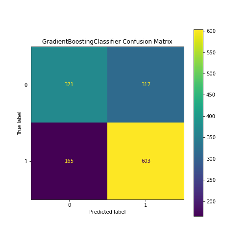

# Contraception Choice Classification

My motivation for this project came from my belief that contraception is integral for life planning. However, some people face barriers when it comes to contraceptive education and access. If we can understand what factors contribute to contraceptive method usage, then we can focus on expanding access and education to groups that might need it the most. 

**Tools used:** sklearn, pandas, streamlit, SQL, SHAP, and Tableau
**Classification Models considered:** Logistic regression, KNN, RandomForestClassifier, GradientBoostingClassifier

**Model Features:** Age, num children born, num living children, age at first marriage, age at first intercourse, freq of intercourse, Religion, children in residence, knowledge of ovulatory cycle, knows method source, desire for more kids, woman worked after marriage, woman currently working, heard FP message in last month, has transportation, media exposure level, education level, literacy, husband's edu level, husband's literacy, knowledge of methods

**Target Variable:** Contraception method being used at time of survey (none, short-term, or long-term)

# Methodology
This project was completed through an iterative process. I began by getting a baseline "First Simple Model" with minimal features/processing, and continuously improved upon it.

# Data Collection

The data comes from a 1987 Demographic and Health Survey conducted in Indonesia. You can see the survey description and apply for access to the data [here](https://dhsprogram.com/methodology/survey/survey-display-14.cfm).

[Data Loading Notebook](https://github.com/Neda-Sal/Contraception_Choice_Classification/blob/main/Data_Collection_Full_Survey.ipynb)

[SQL Component](https://github.com/Neda-Sal/Contraception_Choice_Classification/blob/main/SQL%20component.ipynb)

# Data Processing

I did minimal data preprocessing in the notebook for my [First Simple Model](https://github.com/Neda-Sal/Contraception_Choice_Classification/blob/main/First_Simple_Model.ipynb). After getting a baseline model, I created a [data preprocessing module ](https://github.com/Neda-Sal/Contraception_Choice_Classification/blob/main/pre_process.py) which has functions to view column values, and convert them into binary or ordinal values. I used this module to process the data in [Second Model Data Processing](https://github.com/Neda-Sal/Contraception_Choice_Classification/blob/main/Model_2_Data_processing.ipynb) for the second iteration of my project.

# Second Iteration

For the second iteration, I added more features and trained Logistic regression, KNN, RandomForestClassifier, GradientBoostingClassifier on the data to compare results between models. I wrote a basic pipeline to compare these models which can be found  [here](https://github.com/Neda-Sal/Contraception_Choice_Classification/blob/main/compare_models.py). 

[Multi-Class Model Comparison](https://github.com/Neda-Sal/Contraception_Choice_Classification/blob/main/multiclass_model2_choice.ipynb)

# Third Iteration

Due to imbalance in the dataset, the short-term class was poorly classified by these models. To address this issue, I initially used random oversampling. However, I ultimately decided to convert the problem into a binary classification problem as I was already grouping the classes into "no use/short-term use" and "long-term use" in my analysis.

[Binary Classification Model](https://github.com/Neda-Sal/Contraception_Choice_Classification/blob/main/Binary_model.ipynb)

# Final Model Choice Analysis

My top priorities when choosing a model were to be able to interpret the feature importance, maximize the number of true negatives (negative being no use/short-term use) and minimize the number of false positives. In other words, I wanted my model to correctly classify as many women as it could that were not using contraception, without predicting that women were using long-term methods when, in fact, they were not.

For these reasons, the final model I chose was GradientBoostingClassifier. The corresponding confusion matrices and ranked feature importance can be seen below.

# Presentation

I created an app using streamlit that takes user input and generates a prediction based on the features.

[APP Demo](https://github.com/Neda-Sal/Contraception_Choice_Classification/blob/main/contraception_streamlit_app.webm)

[Final Presentation Slidedeck](https://github.com/Neda-Sal/Contraception_Choice_Classification/blob/main/Contraception_Choices_Presentation.pdf)

## Appendix

[Plotly 3D Visuals](https://github.com/Neda-Sal/Contraception_Choice_Classification/blob/main/plotly_visuals.ipynb)
